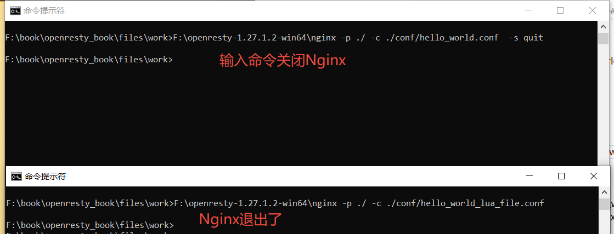
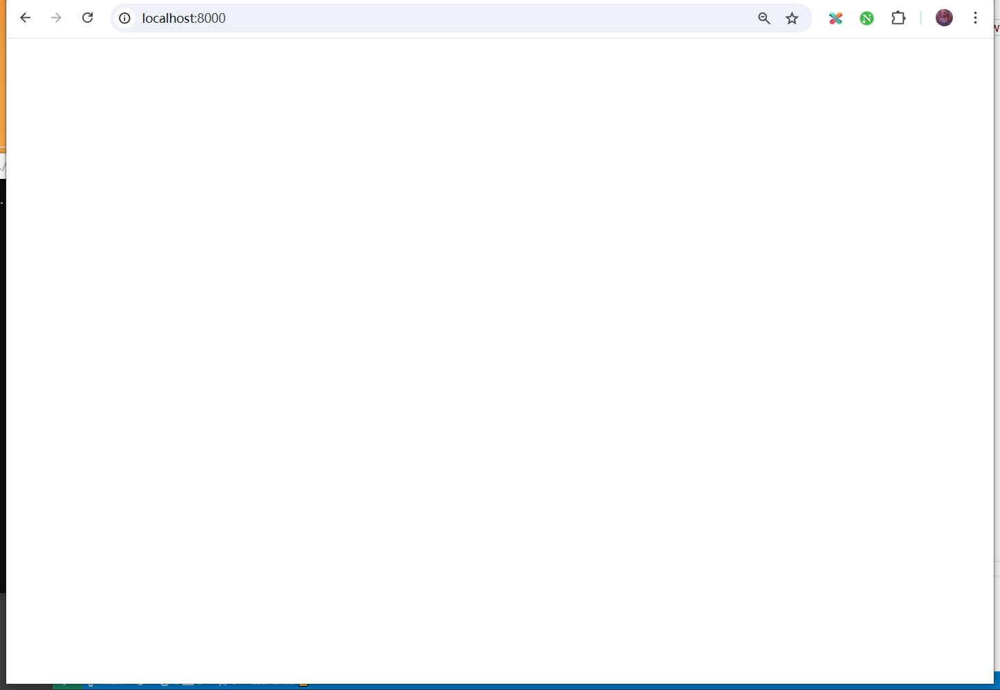
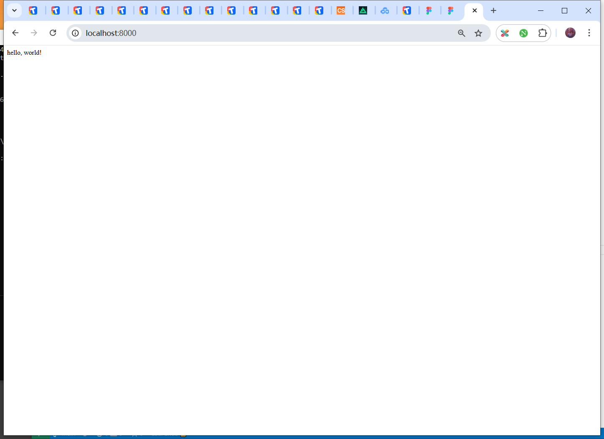

## HelloWorld

OpenResty就是Nginx，Nginx运行时需要一个配置文件来设置监听端口、根目录等，OpenResty也是一样的。

新建`work`文件夹作为OpenResty的工作文件夹。

然后在里面新建`conf`文件夹用于存储配置文件，新建`logs`文件夹来存放日志。

下面来运行OpenResty第一个例子。

### 1. 准备配置文件

新建配置文件：`files\work\conf\hello_world.conf`

```conf
worker_processes  1;
error_log logs/error.log;
events {
    worker_connections 1024;
}
http {
    server {
        listen 8000;
        location / {
            default_type text/html;
            content_by_lua_block {
                ngx.say("<p>hello, world</p>")
            }
        }
    }
}
```

然后打开CMD，进入到上面创建的`work`目录，执行命令：

```bat
F:
cd F:\book\openresty_book\files\work
F:\openresty-1.27.1.2-win64\nginx -p ./ -c ./conf/hello_world.conf
```


这样就启动了OpenResty，其实就是启动了Nginx，并且按照编写的配置文件运行。

在配置文件中，`listen 8000;`指定了Nginx在`8000`端口上监听Http请求。

那么打开浏览器，访问`http://localhost:8000/`，就能访问我们的网站。


输入下面命令关闭Nginx：

```bat
F:
cd F:\book\openresty_book\files\work
F:\openresty-1.27.1.2-win64\nginx -p ./ -c ./conf/hello_world.conf  -s quit
```



### 2. Nginx执行Lua代码

当在浏览器中访问网站时，Nginx执行了在配置文件中写的Lua代码：

```
content_by_lua_block {
    ngx.say("<p>hello, world</p>")
}
```

`content_by_lua_block`里包含的就是要执行的Lua代码，可以修改它试试。


### 3. 运行Lua文件

上面是一个简单例子，一般我们都是将代码写到Lua文件中。

```lua
--file: files\work\service\hello_world.lua

local test={}

function test:say_hello()
    return "Hello, World!"
end

return test
```

然后修改配置文件去执行Lua代码文件。

```
#file:files\work\conf\hello_world_lua_file.conf

worker_processes  1;
error_log logs/error.log;
events {
    worker_connections 1024;
}
http {
    server {
        listen 8000;
        location / {
            default_type text/html;
            content_by_lua_block {
                local hello_world = require "service.hello_world"
                hello_world:say_hello()
            }
        }
    }
}
```

其实就是这两行：

```lua
local hello_world = require "service.hello_world"
hello_world:say_hello()
```

执行命令：

```bat
F:
cd F:\book\openresty_book\files\work
F:\openresty-1.27.1.2-win64\nginx -p ./ -c ./conf/hello_world_lua_file.conf
```

执行后打开网页发现网页一片空白。




仔细对比代码发现，Lua文件中的`say_hello`返回了字符串`Hello, World!`，这并没有什么用。

要想在网页上显示，需要用`ngx.say`才行。

修改代码：


然后无需重新启动Nginx，而是输入命令进行Reload：

```bat
F:
cd F:\book\openresty_book\files\work
F:\openresty-1.27.1.2-win64\nginx -p ./ -c ./conf/hello_world_lua_file.conf  -s reload
```

再刷新网页，看到已经正常输出了。

