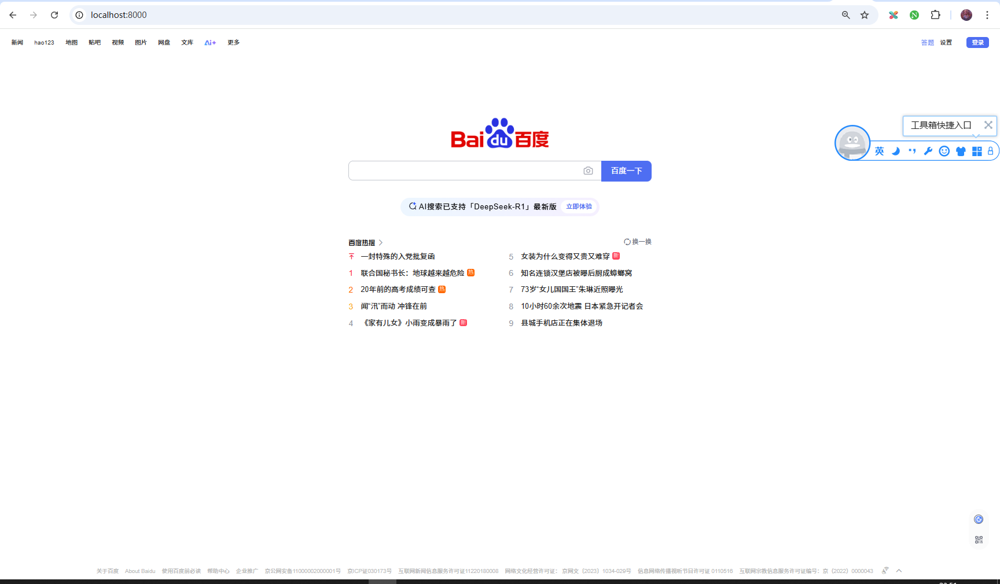

## 反向代理

在以前Web网站论坛为主的时代，域名是用户访问互联网必须的东西，域名访问的人越多，这个域名的权重就越高，在百度的排名就更前。

很多人为了把域名的权重刷高，就开始做镜像网站，当用户访问A域名，实际看到的确是BiliBili。

还有谷歌被屏蔽之后，网上也出现了很多谷歌的镜像网站。

这些就是利用了Nginx的反代功能。

反代就是将你访问A网站的请求，全部转给B网站。然后将B网站返回的内容，再转给你。

下面来实操。

### 反向代理配置

新建配置文件`files\work\conf\proxy_baidu.conf`：

```conf
worker_processes  1;
error_log logs/error.log;
events {
    worker_connections 1024;
}
http {
    server {
        listen 8000;
        location / {
            proxy_pass https://www.baidu.com; # 核心代理指令
            proxy_set_header Host www.baidu.com; # 关键：修改Host头为百度域名
            proxy_set_header X-Real-IP $remote_addr;
            proxy_set_header X-Forwarded-For $proxy_add_x_forwarded_for;
            proxy_set_header X-Forwarded-Proto $scheme;
            proxy_ssl_server_name on; # 启用SNI支持（若百度使用SSL）
        }
    }
}
```

这里配置了目标网站为百度。

启动Nginx：

```bat
F:
cd F:\book\openresty_book\files\work
F:\openresty-1.27.1.2-win64\nginx -p ./ -c ./conf/proxy_baidu.conf
```

现在打开浏览器访问`http://localhost:8000/`，就会发现实际访问了百度，而网址却仍然是`http://localhost:8000/`。

